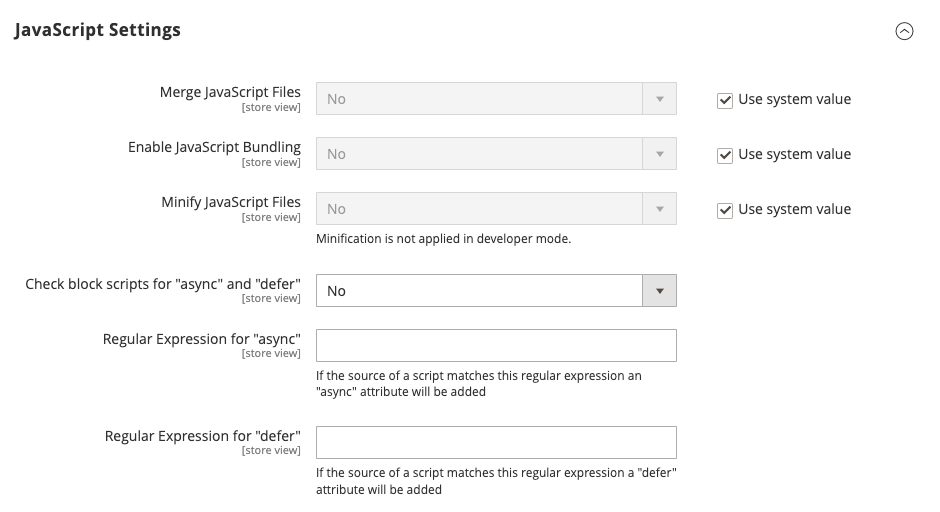

# Async / Defer JS
"Async Defer JS" is a module which adds a configuration that says what HTML scripts should get an "async" or "defer" attribute.

It acts upon scripts added as page assets. A script which is added by a third party through some other way than a page asset won't get 
the "async" or "defer" attribute even if it matches one of the regular expressions configured.

## Installation
Run the following command in the root of Magento 2.

```
$ composer require weprovide/magento2-module-async-defer-js
```

Once installed the only thing left to do is actually enable it.

```
$ bin/magento module:enable WeProvide_AsyncDeferJs
$ bin/magento setup:upgrade --keep-generated
```

## Configuration
In `System > Configuration > Advanced > Developer > JavaScript Settings` two configuration settings can be seen. One of them
is the regular expression used for the `async` HTML attribute, the other for `defer`.


